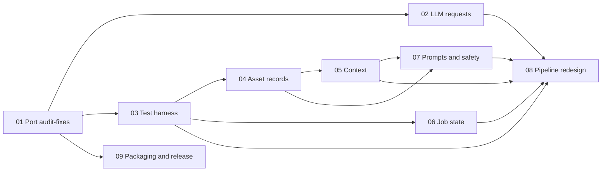

# Agent Review: Implementation Roadmap

Date: 2026-10-07 · App version: 1.3.2 · Code audited at `main` `a34dcf3`

This folder turns the October 2026 review of the agent and backend into implementation plans. Each plan stands on its own: it describes the current code, the change, code sketches, tests, and how to verify the result. File and line references are as of `a34dcf3`. Line numbers drift, so search for the quoted code if a number is off.

## Read this first

1. **A tested fix set is sitting on a local branch.** The branch `audit-fixes` (commit `d00be56`, 2026-10-03) already fixes the default-model failure, the Pexels quota stall, unvalidated download redirects, and several job lifecycle bugs. It exists only on this machine: `git branch -vv --all` shows no `origin/audit-fixes`. Push it before doing anything else:

   ```bash
   git push -u origin audit-fixes
   ```

   It was branched from `904c261`, before PR #4 and the renderer refactor landed, so it can't be merged as is. [Plan 01](01-port-audit-fixes.md) ports it file by file. Most main-process files it touches are unchanged on `main` since then, so the port is mostly `git checkout d00be56 -- <file>`.

2. **The default setup fails on the first LLM call of every job.** The default model is `gpt-4o`, which allows 16,384 output tokens, and every structured call asks for 32,768. OpenAI answers HTTP 400, and the app treats a 400 as permanent. "Test connection" still passes because it asks for 10 tokens. Plan 01 phase 1 fixes this and should ship first.

3. **Nothing tests the agent runner.** The 258 tests pass, but none of them load `agent-runner.ts`, so every runner bug in these plans was found by reading the code or with a throwaway harness. [Plan 03](03-runner-test-harness.md) makes the runner loadable in tests. Land it before the runner changes in plans 04 to 06, so each fix ships with a test that failed before it.

## The plans

| Plan                                                                | What it fixes                                                                                                                                                                              | Size | Depends on        |
| ------------------------------------------------------------------- | ------------------------------------------------------------------------------------------------------------------------------------------------------------------------------------------ | ---- | ----------------- |
| [01 Port audit-fixes](01-port-audit-fixes.md)                       | HTTP 400 on the default model, Pexels quota stall, unvalidated redirects, lifecycle bugs, Electron 39 out of support                                                                       | M    | —                 |
| [02 LLM requests](02-llm-requests.md)                               | "Test connection" passing while jobs fail, the fixed 600-second LLM timeout, Gemini thinking budget, no cache metrics                                                                      | M    | 01                |
| [03 Runner test harness](03-runner-test-harness.md)                 | No runner tests, no fake providers, no evaluation set                                                                                                                                      | M    | 01 phase 1        |
| [04 Asset records and downloads](04-asset-records-and-downloads.md) | A duplicate clip fails the job, wrong resolution in file names, downloads that wait on the model, resume failing when turns are spent, approval pauses that skip calls                     | M    | 03                |
| [05 Context and tool results](05-context-and-tool-results.md)       | Compaction hiding fresh search results, 5,000-token tool results, the model choosing download URLs, prompt-cache churn                                                                     | M    | 03, 04            |
| [06 Job state and IPC](06-job-state-and-ipc.md)                     | Twelve places in the runner that set job status, read handlers that write, Library edits lost while a job runs, unbounded log payloads, settings changing mid-job, token usage never shown | M    | 01, 03            |
| [07 Prompts and safety](07-prompts-and-safety.md)                   | Prompt contradictions, style and visual concept ignored, beat-split retries, safety toggles that only exist in the prompt                                                                  | M    | 04, 05            |
| [08 Pipeline redesign](08-pipeline-redesign.md)                     | An open-ended loop of up to 30 model turns doing a job with fixed steps                                                                                                                    | L    | 02 to 07          |
| [09 Packaging and release](09-packaging-and-release.md)             | About 38 MB of renderer libraries shipped twice, no auto-update, unsigned builds, stale README claims                                                                                      | M    | 01 phases 4 and 6 |

Sizes: S is under a day, M is two to four days, L is two to three weeks, for one developer who knows the code. They are estimates.

## Order of work



**Week 1: stop the failures.**

1. Push `audit-fixes` (plan 01 phase 0).
2. Plan 01 phases 1 to 3: port the main-process fixes and their tests. Phase 1 alone makes the default setup work.
3. Plan 03 phases 1 to 4: make the runner loadable in tests, add the fake network, and write the regression tests as `todo`.
4. Plan 04 phases 1 to 4, flipping the matching regression tests from `todo` to required.

**Week 2: make the loop correct and cheaper.**

5. Plan 05 phases 1 and 2: the compaction fix and slim tool results.
6. Plan 06 phases 1 to 4: status transitions, reads that don't write, one writer per job, small logs.
7. Plan 02 phases 1 to 4: a "Test connection" that uses real job parameters, complete token usage, the Gemini thinking budget, and the timeout label.
8. Plan 07 phases 1 to 4: prompt cleanup, style and visual concept, the sentence-based beat split, and safety filters.

**Week 3: measure, and finish the job-level work.**

9. Plan 03 phase 5: the evaluation set. Run it on the week 2 result to get a baseline.
10. Plan 05 phases 3 and 4, and plan 07 phases 5 and 6: budget-based compaction, the shot-count hint, and the before-and-after measurements.
11. Plan 06 phases 5 and 6: per-job settings (plan 08 needs them) and the token usage display.
12. Plan 01 phase 5: renderer behaviors from the audit that `main` still lacks.

**Weeks 4 to 6: the redesign, behind a setting.**

13. Plan 08 phases 1 to 4. Switch the default only if the comparison in phase 4 passes. Phase 5 (thumbnails) is optional. Phase 6 (deleting the loop) comes one release after the switch.

**Separate track, any time:** plan 09, plan 01 phases 4 and 6 (the Electron upgrade, builder and tooling), and plan 02 phase 5 (streaming, optional). They touch packaging, CI, or the HTTP layer, not agent logic, and should ship as their own PRs so a regression bisects cleanly.

## Conventions for every plan

- One branch per plan and one commit per phase. Each phase leaves the app working.
- Every phase ends with `npm run lint`, `npm run typecheck`, `npm test`, and the manual check listed in that phase.
- A bug fix lands with a test that fails without it. When the test needs the runner harness, plan 03 adds it as `it.todo(...)` and the fixing plan turns it into a normal `it(...)`.
- Prompt changes update `test/prompt-quality.test.ts` in the same commit.
- No model tables. `docs/04-api-contracts-and-research.md` says the app passes the user's model id through unchanged ("The app must not maintain a hard-coded allowlist for model ids", "Never silently replace the user's model id"). Provider limits are learned from the provider's own error responses instead.
- No new runtime dependency unless the plan says why. The only one proposed is `electron-updater` (plan 09).

## Definition of done

- A fresh install with default settings completes a 10-beat job against the live OpenAI API.
- Fake end-to-end tests under `test/runner/` cover a normal job, approval mode, pause and resume, resume with the turn budget spent, a clip chosen for two beats, an exhausted Pexels quota, and the token-cap retry.
- Before each release, one live job per provider (OpenAI, OpenRouter, Gemini) is run and recorded in the release notes.
- The README describes what the app does today.

## Not planned

- A model allowlist or price table. Both conflict with docs/04.
- Automatic failover to another provider. A failing provider should stop the job with a clear message, not switch vendors and billing without asking.
- Accounts, cloud sync, or telemetry.
