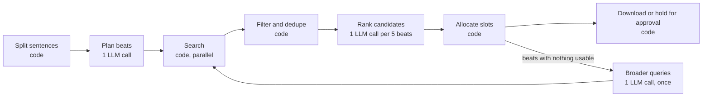

# Plan 08: Pipeline Redesign

Status: proposed · Size: L (two to three weeks) · Depends on: plans 02 to 07. Plan 03 phase 5 (the eval set) is required before the switch.

## Why

Every job follows the same steps: split the script, search, pick, download. The runner still hands control to the model for up to 30 turns. Each turn resends the whole conversation, and the model decides what to do next. Much of `agent-runner.ts` exists to keep that loop on track:

- three kinds of nudge message
- a parser that recovers tool calls written as plain text (`tool-parser.ts`)
- a status snapshot appended to every request
- turn-budget warnings
- several overlapping exit conditions

The commit history reads as patches on that emergent behavior: "harden agent loop exit", "handle text-only tool turns", "exit loop when beats fulfilled", "stop Broad post-search nudges from interrupting select", "make iteration budget job-wide", "harden pause/resume".

docs/02 already states the principle: "The model is allowed to choose tools, but code decides when the run is finished, when limits are reached, and whether arguments are valid." This plan takes it one step further. Code runs the fixed steps, and the model is called only for the two decisions that need language understanding: how to split and describe the script, and which candidates fit each beat.

## Current state (audited)

- `runAgentLoop` is lines 962 to 1203 and `executeToolCall` is lines 1243 to 1718 of the 2,012-line `agent-runner.ts`. Together with `search-mode.ts` (250 lines, mostly the prompt and nudges) and `message-compaction.ts`, that's roughly 1,000 lines of loop machinery.
- A job takes at least three full-context turns after the beat split (search, select, download), and more when results are weak, the model stalls, or the beats don't fit in one batch. With plan 05's slim results, each turn still resends a growing conversation.
- Model-visible state is reconstructed every turn from the conversation plus a status block (`messagesWithCacheStablePrefix`). The code already holds the real state: beats, candidates, records.
- The pieces a pipeline needs already exist or are being built:
  - beat planning with queries (plan 07 phase 3)
  - candidate caching (`pexelsCandidates`, persisted in agent-state, lines 547 and 559)
  - variant choice (plan 05 phase 2)
  - record creation with real dimensions (plan 04 phase 2)
  - `queueDownload` (plan 04 phase 3)
  - approval and status handling (plans 04 and 06)
  - Pexels quota handling (plan 01 phase 2)
  - the LLM rate limiter (`LlmRateLimiter.waitForSlot`)

## Goals

- A job makes a fixed, small number of LLM calls: one to plan, one per batch of about five beats to rank, and at most one retry round for beats with nothing usable.
- Each step is a function with injected clients, testable without the runner.
- Resume continues from the last finished step, with no repeated Pexels searches or LLM calls.
- User-visible results (manifest, file names, Library, approval flow) are unchanged.
- At least as relevant as the loop on the eval set, with no more tokens or wall time.

## Non-goals

- Changing the manifest format or the renderer beyond step-level progress text.
- Removing approval mode. It gets better: a rejected asset is replaced from the ranked list without another LLM call.
- Keeping the free-running loop as a permanent second mode. It stays only until the pipeline wins the comparison, then it's deleted.

## The pipeline



| Step        | Who                     | Input                                                   | Output                                                                                               |
| ----------- | ----------------------- | ------------------------------------------------------- | ---------------------------------------------------------------------------------------------------- |
| 1. Split    | Code                    | Script                                                  | Numbered sentences (plan 07 `splitScriptSentences`)                                                  |
| 2. Plan     | Model, 1 call           | Sentences, style, visual concept, safety                | Beats with visual prompt, 2 or 3 queries, asset type (plan 07 `submit_beat_plan`)                    |
| 3. Search   | Code                    | Beat queries, platform, mix                             | Raw Pexels results per beat                                                                          |
| 4. Filter   | Code                    | Raw results                                             | Candidates per beat: right shape, resolution, and duration, safety-filtered, user rejections removed |
| 5. Rank     | Model, 1 call per batch | Beat text plus compact candidates (thumbnails optional) | Ordered candidate ids per beat, or "none fit"                                                        |
| 6. Allocate | Code                    | Rankings, caps, existing assets                         | One asset per beat (or the per-beat target), unique across beats                                     |
| 7. Download | Code                    | Allocations                                             | Records, then queued downloads or a pause for approval                                               |
| 8. Retry    | Model, 1 call, once     | Beats with nothing usable and what was tried            | Broader queries, then steps 3 to 7 for those beats only                                              |

For a 15-beat job that's about 6 LLM calls (1 plan, 3 rank batches, at most 1 retry plan, 1 retry rank), each with a small, fixed context. The loop needs the beat split plus at least 3 turns (2 after plan 04), each resending the conversation so far, and more whenever a beat needs a second search. The gain is less about the number of calls than about context size and predictability. Measure the real difference with the eval set (phase 4).

## Key decisions

| Decision           | Choice                                                                                                                                         | Why                                                                                        |
| ------------------ | ---------------------------------------------------------------------------------------------------------------------------------------------- | ------------------------------------------------------------------------------------------ |
| Integration        | A second engine inside `AgentRunner`, selected per job, sharing lifecycle, persistence, downloads, and finalize                                | Reuses everything plans 01 to 06 fixed. A separate runner class would duplicate it.        |
| Step interfaces    | Plain async functions that take a `PipelineContext`                                                                                            | Testable with fakes. No runner needed.                                                     |
| Ranking output     | Ordered ids per beat, not a single pick                                                                                                        | Allocation can resolve duplicates and approval rejections without calling the model again. |
| Batch size         | 5 beats per rank call, in parallel under the LLM rate limiter                                                                                  | Keeps each prompt small and focused. Parallel batches keep wall time low.                  |
| Search breadth     | Focused mode searches the first query, plus the second if fewer than 5 candidates survive filtering. Broad mode searches all queries up front. | Keeps the two existing modes meaningful and Pexels usage predictable.                      |
| Resume granularity | Step boundaries. State is persisted after each step.                                                                                           | Simple, and no step is long.                                                               |
| Rollout            | A per-job engine setting, default "loop" until the eval comparison passes                                                                      | Lets both engines run on the same scripts.                                                 |

## Phases

### Phase 1: Seams in the runner (S)

No behavior change. Extract what the pipeline will call, so both engines share it:

1. `private cacheCandidates(results, type, query)`: the candidate caching from the search branches (lines 1290 to 1307 and 1362 to 1381).
2. `private createAssetRecord(beat, candidate, variant): AssetRecord`: record creation from the select branch (lines 1484 to 1520), including plan 04's dimension fix and plan 04's duplicate check.
3. `queueDownload` and `holdForApproval`: plan 04 phase 3 already extracts `queueDownload`. `holdForApproval` sets records to `pending` and pauses with reason `awaiting_approval` (plan 06 phase 2).
4. `private async searchPexels(type, params, signal)`: wraps `PexelsClient.searchPhotos` and `searchVideos` with the quota handling from plan 01 phase 2.
5. `private async callStructured<T>(tool, systemPrompt, userContent, parse): Promise<T>`: one forced tool call with the job's provider, the quirk handling from plan 01, usage accounting, the timeout, and the text-call fallback. `parseScriptIntoBeats` and `expandIdeaIfNeeded` move onto it, which removes their duplicated request code.

**Tests:** the existing runner tests (plan 03) pass unchanged.

### Phase 2: The steps, as testable modules (M)

Create `src/main/services/pipeline/`:

```text
pipeline/
  context.ts           PipelineContext and shared types
  plan-beats.ts        step 2 (wraps plan 07's beat plan tool)
  search.ts            step 3
  filter.ts            step 4 (pure)
  rank.ts              step 5
  allocate.ts          step 6 (pure)
  broaden.ts           step 8
  run-pipeline.ts      orchestration, persistence between steps
```

**`context.ts`**

```ts
export interface PipelineContext {
  input: StartJobInput
  settings: JobRuntimeSettings // plan 06 phase 5
  signal: AbortSignal
  searchPhotos(params: PhotoSearchParams): Promise<PexelsPhotoSearchResponse>
  searchVideos(params: VideoSearchParams): Promise<PexelsVideoSearchResponse>
  callStructured<T>(request: StructuredRequest<T>): Promise<T>
  log(type: 'info' | 'error', message: string): void
  progress(step: string, percent: number): void
  saveState(state: PipelineState): Promise<void>
}

export interface Candidate {
  key: string // `${type}_${pexelsId}`
  type: 'photo' | 'video'
  pexelsId: number
  about: string // alt text or URL slug (plan 05)
  shape: Shape
  width: number
  height: number
  seconds?: number
  thumbnailUrl: string
}

export interface PipelineState {
  step: 'planned' | 'searched' | 'ranked' | 'allocated' | 'retried' | 'done'
  candidatesByBeat: Record<string, string[]> // beat id to candidate keys; full candidates live in pexelsCandidates
  rankingByBeat: Record<string, string[]> // beat id to ordered candidate keys
  retriedBeats: string[]
}
```

**Step 3: `search.ts`**

```ts
/** Searches for every beat, a few at a time. Returns raw results keyed by beat id. */
export async function searchBeats(
  ctx: PipelineContext,
  beats: PlannedBeatWithId[],
  mode: SearchMode
): Promise<Map<string, RawResult[]>>
```

- Orientation is `shapeForPlatform(platform)`, from plan 05.
- The type comes from the mix, then the beat's `assetType`. "either" with both types allowed searches videos first, then photos only if fewer than 5 video candidates survive filtering.
- Run 4 searches at a time (a small pool helper, no dependency). Plan 01's quota handling pauses the job if Pexels runs out.
- Expected Pexels calls: about 1.3 per beat, so roughly 20 for a 15-beat job. The documented default limit is 200 per hour (verify).

**Step 4: `filter.ts` (pure)**

```ts
export interface FilterRules {
  shape: Shape
  minLongEdge: number // 1920 for video files, 1600 for photo sources
  videoSeconds: { min: number; max: number } // 4 to 30
  avoidPeople: boolean
  skipExplicit: boolean
  rejectedKeys: Set<string> // user rejections across the job
}

/** Keeps candidates that fit the job, ordered as Pexels returned them, at most `limit` per beat. */
export function filterCandidates(results: RawResult[], rules: FilterRules, limit = 12): Candidate[]
```

- Uses `shapeOf`, `mentionsPeople`, `isExplicitText`, and `chooseVariant` from plans 05 and 07. A candidate with no usable variant is dropped.
- Square results pass for either shape only when nothing else is left.
- Duplicates across beats are kept here. Allocation makes picks unique.

**Step 5: `rank.ts`**

The tool:

```ts
export const SUBMIT_RANKINGS_TOOL: NormalizedToolDefinition = {
  name: 'submit_rankings',
  description:
    'For each beat, list the candidates that fit, best first. Leave a beat empty if none fit.',
  parameters: {
    type: 'object',
    properties: {
      beats: {
        type: 'array',
        items: {
          type: 'object',
          properties: {
            beatId: { type: 'string' },
            ranked: {
              type: 'array',
              items: { type: 'string' },
              description: 'Candidate keys, best first, at most 5.'
            }
          },
          required: ['beatId', 'ranked']
        }
      }
    },
    required: ['beats']
  }
}
```

The user content for one batch, compact and stable:

```text
beat_3: "Fortunes vanished in a single afternoon."
Visual prompt: stock market screen red
Candidates:
- video_1234: stock market screen red numbers, landscape, 12s
- video_5678: trader holding head in hands, landscape, 8s
- photo_91011: red stock chart on monitor, landscape
```

The system prompt carries what the StockScout's selection guidance says today, reduced to ranking:

- judge by description; you cannot see the footage
- prefer clips that show the beat's subject
- prefer variety within a batch
- the style and visual direction lines from plan 07 phase 2

Validation drops keys that weren't offered for that beat, and caps each list at 5. Batches run in parallel through `ctx.callStructured`, and each call waits for `LlmRateLimiter.waitForSlot`.

**Step 6: `allocate.ts` (pure)**

```ts
export interface AllocationInput {
  beats: Array<{ id: string; existing: string[] }> // keys already held by the beat (resume, earlier rounds)
  rankingByBeat: Record<string, string[]>
  perBeatTarget: number // plan 07 phase 5, default 1
  totalCap: number
  takenKeys: Set<string> // keys held by any beat, plus user rejections
}

/**
 * Round-robin in beat order: every beat gets its best free candidate before any beat
 * gets a second. Stops at the cap. Never gives one candidate to two beats.
 */
export function allocateSlots(input: AllocationInput): Array<{ beatId: string; key: string }>
```

This replaces `selectionBudgetViolation`, the "spread the cap" prompt paragraph, and the duplicate check, with one function and a test table.

**Step 7: download or hold.** For each allocation:

1. Look up the candidate.
2. Call `chooseVariant`, then `createAssetRecord`.
3. Call `queueDownload` (approval off), or collect the records for `holdForApproval` (approval on).

After approval, rejected records are replaced: run `allocateSlots` again with the rejections in `takenKeys`. That gives the next-ranked candidate for those beats, then hold again for the replacements only. No LLM call is needed.

**Step 8: `broaden.ts`**

A beat qualifies when its ranking is empty or every ranked key is taken. One forced call for all of them:

```ts
export const SUBMIT_BROADER_QUERIES_TOOL = {
  name: 'submit_broader_queries',
  description: 'Write broader Pexels queries for beats whose searches found nothing usable.'
  // beats: [{ beatId, queries: string[] (2 or 3, 1 to 4 words) }]
}
```

The input lists each beat's text, its visual prompt, and the queries already tried. Then steps 3 to 7 run for those beats only. This happens once. Beats still empty after that are listed in the final summary with the queries tried, so the user can reword them.

**`run-pipeline.ts`**

```ts
export async function runPipeline(ctx: PipelineContext, job: PipelineJob): Promise<void> {
  const state = job.state ?? {
    step: 'planned',
    candidatesByBeat: {},
    rankingByBeat: {},
    retriedBeats: []
  }
  if (state.step === 'planned') {
    /* search and filter */ state.step = 'searched'
    await ctx.saveState(state)
  }
  if (state.step === 'searched') {
    /* rank */ state.step = 'ranked'
    await ctx.saveState(state)
  }
  if (state.step === 'ranked') {
    /* allocate, download or hold */ state.step = 'allocated'
    await ctx.saveState(state)
  }
  if (state.step === 'allocated') {
    /* broaden once, then search, filter, rank, allocate those beats */ state.step = 'retried'
    await ctx.saveState(state)
  }
  state.step = 'done'
  await ctx.saveState(state)
}
```

Check `ctx.signal.aborted` between steps, and pass the signal into every request, so pause and cancel work as they do today.

**Tests (unit, no runner):**

- `filterCandidates`: each rule on its own; square fallback; the limit; ordering kept.
- `allocateSlots`: a table of cases. Cap below the beat count; per-beat target 2; a candidate ranked first by two beats; existing assets on resume; every candidate taken.
- `rank.ts`: keys not offered are dropped; an empty ranking is allowed; a batch of 12 beats splits into 3 calls (a fake `callStructured`).
- `broaden.ts`: only qualifying beats are sent; it runs once.
- `run-pipeline.ts`: resuming at each `step` value skips the finished steps (count the fake calls).

### Phase 3: Runner integration behind a per-job setting (M)

1. Add `engine: 'loop' | 'pipeline'` to `JobRuntimeSettings` (plan 06 phase 5), so a job resumes with the engine it started with. The default comes from a new setting, `agentEngine`, which defaults to `'loop'`.
2. Show it in Settings, in an "Experimental" group: "Search engine: Agent loop / Pipeline (beta)".
3. In `runLoopAndFinalize` (line 626): `runLoop: () => (this.engine === 'pipeline' ? this.runPipelineEngine() : this.runAgentLoop())`. `runPipelineEngine` builds a `PipelineContext` from the runner's seams (phase 1) and calls `runPipeline`. Settle, finalize, and status handling stay shared.
4. Persist `PipelineState` in agent-state.json next to the conversation. A job on the pipeline engine has no conversation.
5. Progress text per step: "Planning beats", "Searching Pexels (12 of 20)", "Ranking footage (batch 2 of 3)", "Downloading". These go into `currentStep`, as today.
6. **Final summary written by code**, logged and stored in the manifest: "15 beats: 14 with footage, 1 without (beat_9 "quantum entanglement", tried: quantum particles, abstract light). 6 model calls, 14,200 tokens."

**Tests (runner, plan 03 harness):**

- Happy path on the pipeline engine with scripted `submit_beat_plan` and `submit_rankings` responses.
- Approval with one rejection: the replacement comes from the ranking, with no extra LLM call (assert the fake LLM call count).
- Pause during ranking, then resume: no repeated searches (assert the Pexels request log).
- A beat with nothing usable triggers exactly one `submit_broader_queries` call.
- Pexels quota exhaustion mid-search pauses with reason `pexels_quota`.

### Phase 4: The comparison (S, needs plan 03 phase 5)

1. Run the eval set on both engines with the same model and the same recorded Pexels responses. The record and replay cache makes searches identical.
2. Compare per script:
   - human relevance score
   - beats covered
   - duplicate picks
   - LLM calls
   - input and output tokens
   - wall time
3. Switch the default to the pipeline when relevance and coverage are at least equal, and tokens and wall time are not higher. A large token cut is expected, but plans 04 and 05 make the loop much leaner first, so the main gains may be predictability and less code. Write the numbers into this file.
4. If relevance is lower, look at the failing beats first. The usual causes are filters that are too strict (step 4) or queries that are too narrow (step 2). Both can be adjusted without touching the structure.

### Phase 5: Thumbnails in ranking (optional, M)

The model ranks from descriptions only. Today's loop is just as blind. Thumbnails can fix that for models that accept images.

1. Add optional images to user messages: `images?: Array<{ url: string }>` on `AgentMessage`.
   - OpenAI-compatible adapter: map to `{ type: 'image_url', image_url: { url, detail: 'low' } }` content parts.
   - Gemini: fetch the bytes and send `inlineData` with base64 (check whether Gemini can take URLs directly).
2. Use small images: Pexels photo `src.tiny`, and the video's preview `image` URL with the same resize parameters, if the CDN honors them (verify).
3. Add a setting, "Use thumbnails when ranking (more tokens)", off by default. Learn "model rejects images" from the provider's 400 the same way plan 01 learns token caps, then fall back to text for that model.
4. Measure the gain on the eval set before recommending it.

### Phase 6: Make it the default, then delete the loop (S)

After the pipeline has been the default for one release with no regressions:

- Delete `runAgentLoop`, `executeToolCall`, `AGENT_TOOLS` and their argument schemas, the nudge builders, `messagesWithCacheStablePrefix`, `message-compaction.ts`, and the StockScout prompt.
- Keep `extractToolCallsFromText` only if the structured calls still need its fallback. Check the logs.
- Remove the `agentEngine` setting and its migration.
- Update `docs/02-agent-architecture.md` to describe the pipeline.

## Risks and mitigations

| Risk                                                 | Mitigation                                                                                            |
| ---------------------------------------------------- | ----------------------------------------------------------------------------------------------------- |
| Ranking from text is no better than the loop's picks | Same information as today. Phase 4 measures it, and phase 5 adds thumbnails.                          |
| Parallel searches use the Pexels quota faster        | About 20 calls per job, under the limiter, with plan 01's quota pause. The pool size is one constant. |
| Parallel rank batches hit provider rate limits       | `LlmRateLimiter.waitForSlot` per call, plus plan 01's retry on 429.                                   |
| The console looks less "agentic"                     | Step logs with counts are clearer than model chatter. Show the code-written summary prominently.      |
| Two engines double the maintenance during rollout    | Deadline: delete the loop one release after the switch (phase 6).                                     |

## Open questions

- After an approval rejection, should replacements download without a second approval round? Proposed: pause again, but show only the replacements.
- Should the per-beat target (plan 07 phase 5) default to 1, with alternatives on request? The allocation supports any value.
