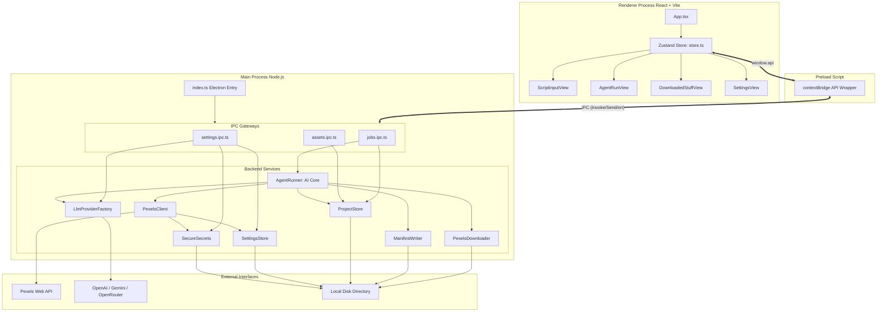

# StockFinder AI — Technical Project Reference (v1.1.3)

StockFinder AI (registered in `package.json` as `stockfinder-ai`) is an Electron-based desktop application designed for video producers, YouTube creators, and short-form editors. It uses an AI-powered agent to parse narrational video scripts into structured visual scenes ("beats"), generate highly contextual visual prompts, search the Pexels API for relevant stock b-roll photos/videos, and automatically download them into a structured local directory structure.

---

## 1. Architectural Overview

StockFinder AI follows Electron’s secure multi-process architecture with strict context isolation. It consists of:

1. **Main Process (`src/main`)**: The Node.js backend. It controls application lifecycle, secure local storage, network requests, file system operations, registers custom privileged protocols (`media://` for streaming local resources safely), and orchestrates the AI search/download agent.
2. **Preload Script (`src/preload`)**: The secure gateway between the main process and the renderer. It exposes a minimal, safe set of IPC methods using Electron's `contextBridge` and `ipcRenderer`.
3. **Renderer Process (`src/renderer`)**: The React frontend built with Vite, styled with Tailwind CSS (v4) and Radix UI primitives. It handles user inputs, renders live run progress, acts as a media dashboard, and triggers configuration settings.

### System Architecture & Data Flow



---

## 2. Directory Layout & Core Files

```
Pexels/
├── .editorconfig               # Editor settings config
├── .github/                    # GitHub actions / workflows
├── .vscode/                    # VS Code environment configurations
├── components.json             # Shadcn-like components setup
├── electron-builder.yml        # Electron builder distribution packing configuration
├── electron.vite.config.ts     # Bundling configs for main, preload, and renderer
├── package.json                # Project dependencies, build scripts, metadata
├── postcss.config.js           # PostCSS setup
├── tailwind.config.js          # Tailwind styling design tokens
├── tsconfig.json               # Main TypeScript config
├── tsconfig.node.json          # Node modules TypeScript configuration (Main/Preload)
├── tsconfig.web.json           # Frontend TypeScript configuration (Renderer)
├── resources/                  # Asset icons and static app binaries
│   └── icon.png
└── src/
    ├── main/                   # ELECTRON MAIN PROCESS (Node.js Environment)
    │   ├── index.ts            # Entry point: Window creation, lifecycle hooks, handler registration
    │   ├── ipc/                # Inter-Process Communication (IPC) Modules
    │   │   ├── assets.ipc.ts   # Core asset listing, local deletion, manifest exporter
    │   │   ├── jobs.ipc.ts     # Background process orchestrator (runs AgentRunner)
    │   │   └── settings.ipc.ts # Preferences management, API validation, folder pickers
    │   └── services/           # Backend Logic Services
    │       ├── agent/
    │       │   └── agent-runner.ts  # Central AI loop orchestrating search and downloads
    │       ├── files/
    │       │   └── manifest-writer.ts # Manages folder structure and appends JSONL logs
    │       ├── llm/
    │       │   └── llm-provider.ts  # Standardized API wrapper for OpenAI, Gemini, OpenRouter
    │       ├── pexels/
    │       │   ├── pexels-client.ts # Interacts with Pexels Search & Media APIs
    │       │   ├── pexels-downloader.ts # High-concurrency chunk downloader with retry logic
    │       │   └── pexels-types.ts  # Zod validation schemas for photo/video payloads
    │       └── storage/
    │           ├── project-store.ts # Tracks historical jobs in userData/projects.json
    │           ├── settings-store.ts # Saves general preferences in userData/settings.json
    │           └── secure-secrets.ts # Encrypts API credentials in userData/secrets.json
    │
    ├── preload/                # IPC BRIDGE LAYER
    │   ├── index.d.ts          # Declarations matching window.api schemas
    │   └── index.ts            # Exposes safe main channels to renderer
    │
    └── renderer/               # REACT CLIENT (Web Environment)
        ├── index.html          # Shell layout template
        └── src/
            ├── env.d.ts        # Vite client declarations
            ├── main.tsx        # React entry-point bundle script
            ├── App.tsx         # Central UI router and sidebar navigation layout
            ├── assets/
            │   └── main.css    # Tailwind import, CSS variables, custom styles
            ├── lib/
            │   ├── api-client.ts # Standardized client referencing window.api
            │   ├── store.ts    # Global state management using Zustand
            │   └── utils.ts    # Style merging utilities (clsx + tailwind-merge)
            ├── components/     # UI Core Elements
            │   ├── Versions.tsx # Helper displaying Chrome, Node, Electron runtimes
            │   └── ui/         # Shadcn-like components (buttons, input, select, sliders, etc.)
            └── routes/         # Views
                ├── agent-run.tsx     # Progress console, live logs, approval portals
                ├── downloaded-stuff.tsx # Media dashboard, local playbacks, metadata explorer
                ├── script-input.tsx  # Setup form for title, script, mix type, visual style
                └── settings.tsx      # Provider credential setup, safety switches, metrics
```

---

## 3. IPC (Inter-Process Communication) Interface

Communication across the isolated boundary is controlled by custom IPC handlers registered on `ipcMain` in the main process and exposed via `ipcRenderer` in the preload script.

| Interface Channel               | Call Type           | Arguments                        | Returns                                          | Description                                                                                      |
| :------------------------------ | :------------------ | :------------------------------- | :----------------------------------------------- | :----------------------------------------------------------------------------------------------- |
| **Settings Channel**            |                     |                                  |                                                  |                                                                                                  |
| `settings:getPublicSettings`    | `invoke`            | None                             | `Promise<PublicSettings>`                        | Retrieves public configurations, obscuring API keys as `••••••••••••••••`.                       |
| `settings:updateSettings`       | `invoke`            | `rawInput: Partial<Settings>`    | `Promise<PublicSettings>`                        | Validates inputs via Zod, writes public preferences to `settings.json`, and updates secure keys. |
| `settings:testProvider`         | `invoke`            | `{ provider, apiKey, modelId }`  | `Promise<ProviderTestResult>`                    | Tests connection for OpenAI, Gemini, or OpenRouter with a simple ping-pong request.              |
| `settings:testPexelsKey`        | `invoke`            | `apiKey: string`                 | `Promise<{ success: boolean, message: string }>` | Verifies Pexels API credentials by calling Pexels search query.                                  |
| `settings:chooseDownloadFolder` | `invoke`            | None                             | `Promise<string \| null>`                        | Triggers Electron's native directory browser dialog.                                             |
| `settings:openAppDataFolder`    | `invoke`            | None                             | `Promise<void>`                                  | Launches OS explorer showing application's local sandbox `userData` folder.                      |
| **Jobs Channel**                |                     |                                  |                                                  |                                                                                                  |
| `jobs:start`                    | `invoke`            | `rawInput: StartJobInput`        | `Promise<string>`                                | Triggers a new job, instantiates an `AgentRunner`, and runs it asynchronously in the background. |
| `jobs:pause`                    | `invoke`            | `jobId: string`                  | `Promise<void>`                                  | Pauses the agent loop execution, triggering network thread cancel flags.                         |
| `jobs:resume`                   | `invoke`            | `jobId: string`                  | `Promise<void>`                                  | Resumes a paused agent loop, resuming visual search checks.                                      |
| `jobs:approveAndResume`         | `invoke`            | `jobId: string`                  | `Promise<void>`                                  | Approves queued asset candidates and triggers the download queue runner.                         |
| `jobs:cancel`                   | `invoke`            | `jobId: string`                  | `Promise<void>`                                  | Halts the current job, marking it as `cancelled` in stores.                                      |
| `jobs:rerun`                    | `invoke`            | `jobId: string`                  | `Promise<string>`                                | Restarts a previously finished or failed run under a new UUID.                                   |
| `jobs:get`                      | `invoke`            | `jobId: string`                  | `Promise<JobSnapshot>`                           | Resolves the combined details of a run (manifest settings, visual beats, and log files).         |
| `jobs:list`                     | `invoke`            | None                             | `Promise<JobSummary[]>`                          | Lists all project logs recorded in the store database.                                           |
| `jobs:event`                    | `send` _(Callback)_ | `event: any`                     | None                                             | Emits live logs, script parsing steps, and download completion metrics to the UI.                |
| **Assets Channel**              |                     |                                  |                                                  |                                                                                                  |
| `assets:list`                   | `invoke`            | `jobId: string`                  | `Promise<AssetRecord[]>`                         | Returns the flat array of all assets parsed from the local `manifest.json`.                      |
| `assets:openInFolder`           | `invoke`            | `jobId: string, assetId: string` | `Promise<void>`                                  | Selects and reveals the downloaded file inside the OS file manager.                              |
| `assets:deleteLocal`            | `invoke`            | `jobId: string, assetId: string` | `Promise<void>`                                  | Deletes the file from disk, updates its manifest entry status to `failed`, and rewrites metrics. |
| `assets:exportManifest`         | `invoke`            | `jobId: string`                  | `Promise<string>`                                | Reads the project's local JSON manifest file contents and returns it as a string.                |

---

## 4. Backend Services (Main Process)

### A. AI Stock Scout (`AgentRunner` - `src/main/services/agent/agent-runner.ts`)

The `AgentRunner` manages the core logic of StockFinder AI. It processes jobs asynchronously in the background and communicates progress updates back to the UI.

#### 1. Execution States

A run goes through the following lifecycle:

```
  [Initializing job] ──> [Analyzing script into beats] ──> [Executing agent search and downloads]
                                                                        │
     ┌─────────────────────────────────── Pause Lock ───────────────────┼─── Require Approval?
     │                                                                  ▼
     ▼                                                      [Awaiting user approval]
 [Paused] ──(Resume/Approve)──> [Queueing Downloads]                    │
     │                                    │                             ▼
     ▼                                    ▼                    [Approve & Download]
[Cancelled]                          [Completed]                        │
     │                                    │                             ▼
     └────────────────────────────────────┴────────────────────────> [Finished]
```

#### 2. Dynamic Progress & Step Tracking

Rather than remaining static during the search and download loops, the runner dynamically calculates progress metrics:
*   **Live Description updates**: Updates `currentStep` in real time with the active action (e.g., `Searching photos for "nebula" (beat 1)`).
*   **Beat-Ratio Progress**: Calculates progress percentages based on the ratio of completed beats, smoothly transitioning from 30% to 90% as files finish downloading.
*   **Detailed Console Logging**: Appends explicit console entries when LLM consults start, when Pexels API calls initiate, and when download queues change state (start, fail, finish).

#### 3. Visual Beat Schema

Each script segment is parsed into a **Visual Beat** structure:

```typescript
interface VisualBeat {
  id: string // e.g. "beat_1", "beat_2"
  text: string // Exact segment script narrative text
  visualPrompt: string // AI visual prompt optimized for stock media discovery
  searchQueries: string[] // List of search terms called by the agent for this beat
  assets: AssetRecord[] // Downloaded or queued assets mapping to this beat
  rejectedAssets?: Array<{ type: 'photo' | 'video'; pexelsId: number; reason: string }> // Rejected items
  status: 'pending' | 'searching' | 'selecting' | 'downloading' | 'completed' | 'failed'
}
```

#### 3. Agent Tool Contract (StockScout Tools)

The agent operates through an iterative loop (up to `maxAgentIterations`) using standard LLM tool calling:

- `search_pexels_photos`: Queries Pexels for static images. Takes parameters `beatId`, `query`, `orientation`, `size`, `color`, `page`, and `perPage`.
- `search_pexels_videos`: Queries Pexels for motion videos. Takes parameters `beatId`, `query`, `orientation`, `size`, `page`, and `perPage`.
- `select_assets_for_download`: Selects asset candidates from search results. Takes selection arrays containing `beatId`, `assetType` (`photo` | `video`), `pexelsId`, `variantUrl`, and a selection `reason`. It also logs rejections with a reason (e.g. `off topic`, `poor composition`, `wrong orientation`, etc.).
- `download_selected_assets`: Triggers downloads for selected assets. Takes an array of `{ assetType, pexelsId }`. If `requireApprovalBeforeDownload` is enabled, this tool returns a status of `awaiting_user_approval` and pauses the agent loop until the user approves the assets in the UI.

---

### B. LLM Wrapper (`LlmProvider` - `src/main/services/llm/llm-provider.ts`)

The `LlmProvider` normalizes communication with different LLM APIs (OpenAI, Gemini, OpenRouter) through a unified interface.

- **OpenAI**: Communicates with the `v1/chat/completions` endpoint. Translates system instructions, message histories, tool definitions, and tool choice selections.
- **OpenRouter**: Integrates with OpenRouter endpoints. Configures special headers (like `HTTP-Referer` and `X-Title`) and parses the response format.
- **Gemini**: Interfaces with Google's API (`v1beta/models/...:generateContent?key=...`). Translates message roles (`user` -> `user`, `assistant` -> `model`, `tool` -> `user` with `functionResponse`).
  > [!IMPORTANT]
  > Gemini requires function parameter types to be uppercase strings (e.g. `STRING`, `NUMBER`, `OBJECT`). `GeminiProvider` automatically formats these types before sending request payloads.

---

### C. Pexels Integration (`src/main/services/pexels/`)

- **`PexelsClient`**: Handles API requests to `api.pexels.com/v1/search` (photos) and `api.pexels.com/videos/search` (videos). It retrieves credentials from `SecureSecrets`, applies request timeout limits, and checks for HTTP 429 rate limit exceptions.
- **`PexelsDownloader`**: An asynchronous, queue-based downloader.
  - **Concurrency**: Features a configurable concurrency limit (1 to 5 concurrent connections).
  - **Retries**: Implements automatic retries (up to 2) with exponential backoff (`delay = 2^retries * 1000` ms) for transient network errors.
  - **Streaming**: Downloads assets in chunks using a streaming reader (`response.body.getReader()`). It writes progress to a `.tmp` file and renames it to the target file name once the download completes.
  - **Validation**: Inspects `content-type` headers to resolve file extensions:
    - Photos: `.jpeg`, `.png`, `.webp`
    - Videos: `.mp4`, `.mov`, `.webm`

---

### D. Data Storage (`src/main/services/storage/`)

#### 1. Project Registry (`ProjectStore` -> `userData/projects.json`)

Saves a flat index of all historical projects for the dashboard dashboard panel.

```typescript
interface JobSummary {
  jobId: string
  projectName: string
  title: string
  script: string
  status: 'running' | 'paused' | 'completed' | 'cancelled' | 'failed'
  createdAt: string
  updatedAt: string
  downloadPath: string
  assetCount: number
}
```

#### 2. Configuration Settings (`SettingsStore` -> `userData/settings.json`)

Saves non-sensitive application settings.

```typescript
interface PublicSettings {
  llmProvider: 'openai' | 'gemini' | 'openrouter'
  modelId: string
  downloadFolder: string
  maxConcurrentDownloads: number
  maxAgentIterations: number
  requestTimeoutSeconds: number
  skipExplicitQueries: boolean
  requireApprovalBeforeDownload: boolean
  avoidPeopleAndFaces: boolean
}
```

#### 3. Secure Key Vault (`SecureSecrets` -> `userData/secrets.json`)

Uses Electron's native `safeStorage` API to encrypt sensitive credentials (like API keys) using OS-level keychains (Keychain Access on macOS, DPAPI on Windows). If encryption is not available on the host system, it falls back to plaintext storage prefixed with `plain:`.

- Keys: `openaiKey`, `geminiKey`, `openrouterKey`, `pexelsKey`
- Encrypted Values: Stored as hex strings prefixed with `encrypted:`.

---

### E. File System Orchestration (`src/main/services/files/manifest-writer.ts`)

Each project is saved in a dedicated folder in the default download directory:

```
[Download Root]/[slugified-project-title]/
├── manifest.json         # Project settings snapshot, parsed visual beats, and download metadata
├── agent-log.jsonl       # Appends structured JSON logs for thoughts, tool calls, and errors
├── photos/               # Target directory for downloaded photos
├── videos/               # Target directory for downloaded videos
└── thumbnails/           # Target directory for thumbnail previews
```

---

## 5. UI Architecture & Renderer Process

### A. Global State Store (`src/renderer/src/lib/store.ts`)

The React frontend uses a **Zustand** store (`useAppStore`) to manage application state:

- **Routing**: Manages the current view page (`currentRoute`).
- **Navigation Hooks**: Synchronizes transitions and loads active job data.
- **IPC Event Stream**: Listens to real-time events via `api.jobs.onEvent()` to update job progress, append console logs, and refresh download metrics in the UI.

### B. Styling System (`src/renderer/src/assets/main.css`)

StockFinder AI uses a dark theme themed with HSL color tokens.

- **Color Palette**: Sleek dark grays (Neutral `#09090b` to `#16161a`) with a violet-to-indigo highlight primary accent (`hsl(263.4, 70%, 50.4%)`).
- **Glassmorphic Design**:
  - `.glass-panel`: Translucent background (`rgba(20, 20, 25, 0.7)`) with `backdrop-filter: blur(12px)` and a subtle light border (`border-white/5`).
  - `.glass-card`: Interactive hover-responsive layouts for list containers.
- **Transitions & Custom Scrollbars**: Smooth webkit-based scroll bars for log consoles and history queues.
- **Flowing Loader Animations**: Custom `@keyframes shimmer` and `.animate-shimmer` linear gradient background shifts applied on progress indicators to convey active API calls.

---

### C. Views & Modules (`src/renderer/src/routes/`)

#### 1. Create Pack View (`script-input.tsx`)

The entry dashboard for starting new projects.

- **Input Form**: Takes a project title and narrative script, with options for target platform layouts, visual styles (cinematic, tech, abstract, etc.), and asset mix types (videos only, photos only, or a combination of both).
- **Run History**: Shows a list of historical runs with status badges (running, paused, completed, failed, cancelled) and a rerun action button.

```
+-----------------------------------------------------------+
|                   CREATE ASSET PACK                       |
|  [Project Title Input]                                    |
|  [Video Script Textarea]                                  |
|                                                           |
|  Platform Layout        Visual Mood                       |
|  [YouTube (16:9)     v] [Cinematic    v]                  |
|                                                           |
|  Asset Mix Type                                           |
|  [Videos Only]     [Photos Only]    [Videos + Photos]     |
|                                                           |
|  Max Assets / Beat      Max Total Downloads               |
|  [ 3 ]                  [ 15 ]                            |
|                                                           |
|  [ === ANALYZE & FETCH VISUAL ASSETS === ]                |
+-----------------------------------------------------------+
```

#### 2. Run Progress View (`agent-run.tsx`)

A dashboard displaying the active agent run status.

- **Progress Dashboard**: Displays a progress bar with a flowing shimmer effect, cost calculations, status badge indicators (with green/purple pulse highlights), and actions. Shows an active loading spinner next to the running step.
- **Script Beats**: Displays visual beats cards featuring:
  - **Download overlays**: An active loader spinner for queued (`pending`) assets, and a live progress bar overlay with percentage labels for assets in the `downloading` status.
- **Agent Console**: Displays real-time logs from the agent (such as thoughts, tool calls, and outputs). Outputs are processed through a formatting module (`renderLogData`) that pretty-prints tool parameters and outputs into structured JSON blocks.

```
+--------------------------------------------------------------------------------+
|  [< Setup]  History of Space Travel                                            |
|  Progress: [=========================>                 ] 45%                   |
|  Status: Running | Beats: 4 | Downloads: 3 complete | Cost: $0.0240            |
+-------------------------------------------------------+------------------------+
|  SCRIPT BEATS                                         |  AGENT CONSOLE         |
|  +-------------------------------------------------+  |  [14:32:01] THOUGHT    |
|  | Beat 1: "Humanity always looked at the stars"   |  |  Searching for space   |
|  | Direction: Cinematic shot of night sky galaxy   |  |  background...         |
|  | Searches: [galaxy nebula] [night sky space]     |  |  [14:32:02] TOOL CALL  |
|  |                                                 |  |  search_pexels_videos  |
|  | Beat Stock Assets:                              |  |  args: query=nebula    |
|  | [Thumbnail]   [Thumbnail]                       |  |  [14:32:04] RESULT     |
|  | video (100%)  photo (ready)                     |  |  Returned 8 videos     |
|  +-------------------------------------------------+  |                        |
+-------------------------------------------------------+------------------------+
```

#### 3. Media Library View (`downloaded-stuff.tsx`)

A dashboard for managing downloaded stock assets.

- **Filters**: Displays assets filtered by type (videos, photos) and status (downloaded, failed).
- **Asset Inspector**: Clicking an asset displays its details, including Pexels source, photographer licensing, dimensions, search query context, and local file path.
- **Media Player**: Plays local video files and displays local images directly in the UI using the custom secure `media://` local streaming protocol to allow seeking, scrubbing, and bypassing CORS blockages.

#### 4. Settings View (`settings.tsx`)

Manages application configuration settings.

- **API Credentials**: Input fields for OpenAI, Gemini, OpenRouter, and Pexels API keys, with connection test buttons for debugging.
- **Performance Sliders**: Configuration sliders for maximum concurrent downloads, maximum agent loop turns, and request timeouts.
- **Safety Switches**: Toggle switches to skip explicit content, avoid faces/people in search results, and require human approval before downloading.

---

## 6. Security Hardening Controls

To protect users against unauthorized access and malicious network requests, StockFinder AI implements several security checks:

1.  **Local Resource Isolation (`media://` scheme)**: By registering the `media` scheme as a privileged custom protocol standard and routing local requests securely through Node's native fetches inside the main process, the system avoids opening up unsafe `file://` resources inside the React browser renderer.
2.  **Protocol Verification**: Ensures the download URL protocol is strictly `http:` or `https:`.
3.  **Domain Filtering (`validateDownloadUrl`)**: Rejects requests targeting local hostnames, loopbacks, or private IP address spaces to prevent Server-Side Request Forgery (SSRF):
    - Blocks: `localhost`, `127.0.0.1`, `0.0.0.0`, `192.168.*`, `10.*`, `172.16.*`, and subdomains ending in `.local`.
4.  **Selection Validation**: Before downloading an asset, the application verifies the download URL and Pexels ID against the search results cached in the `pexelsCandidates` map. This prevents the agent from downloading files from unverified external URLs.

---

## 7. Packaging & Dependency Configuration

The application is built and packaged using `electron-vite` and `electron-builder`.

### Dependencies & Frameworks

- **Electron Core**: `electron` (v39.x) with `@electron-toolkit/utils` and `@electron-toolkit/preload`.
- **Frontend UI**: `react` (v19.x) + `zustand` (v5.x) + `lucide-react` icons.
- **Validation**: `zod` (v4.x) for validating settings payloads, Pexels API payloads, and form inputs.
- **Packaging**: `electron-builder` (v26.x).

### Packaging Scripts (`package.json`)

```bash
# Start development server (with HMR)
$ npm run dev

# Compile TypeScript and bundle build assets
$ npm run build

# Package desktop application directory (unpackaged setup folder)
$ npm run build:unpack

# Build installer packages
$ npm run build:win      # For Windows systems
$ npm run build:mac      # For macOS platforms
$ npm run build:linux    # For Linux systems
```
